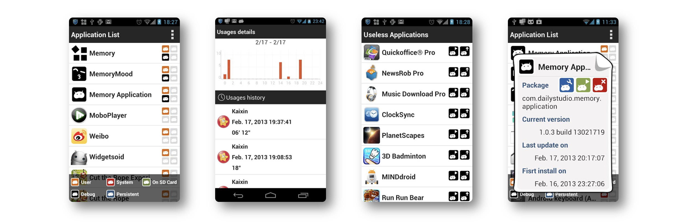

# Memory Plugin - Application

Memory Application is a plugin application for Memory. It helps you to manage your applications efficiently. It tracks your applications' usage and installation histories. It knows what kind of application you will like, and even gives you some advice when you want to remove applications.

