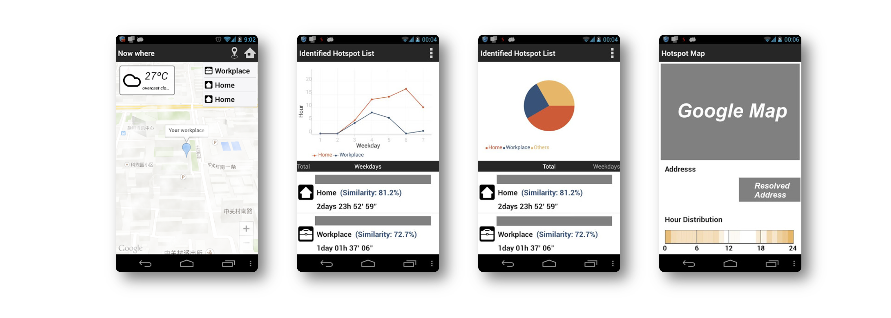

# Memory Plugin - Where

Memory Where is a plugin application for Memory. It collects your daily locations and analyzes some hotspots where you will usually stay, e.g. Home, Workplace, etc. After it recognizes your hotspots, it will track and summarize the time you spend on these spots every day.

