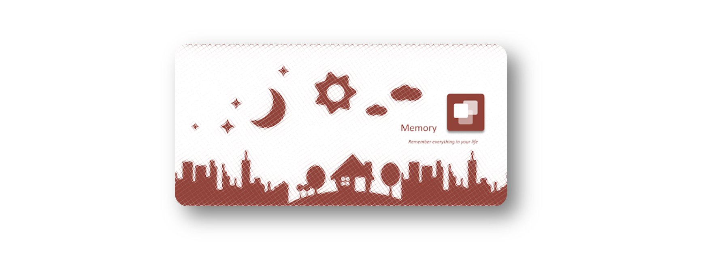

# Memory Applications

Memory is an application that helps you to remember everything in your daily life, such as device boot, mood, application usages, network status, favorites locations. It uses these collected memory pieces to analyze and give you more and more advice to improve your life.

Currently, there are four plugins for Memory:

- **Boot** collects and analyzes each of your device boot-up;
- **Mood** helps you to note your mood and draw a chart of your mood trends in a specific period.
- **Application** helps you to manage your applications on the devices efficiently.
- **Where** helps syou to identify your daily hotspots and record the time you spend on them each day.

